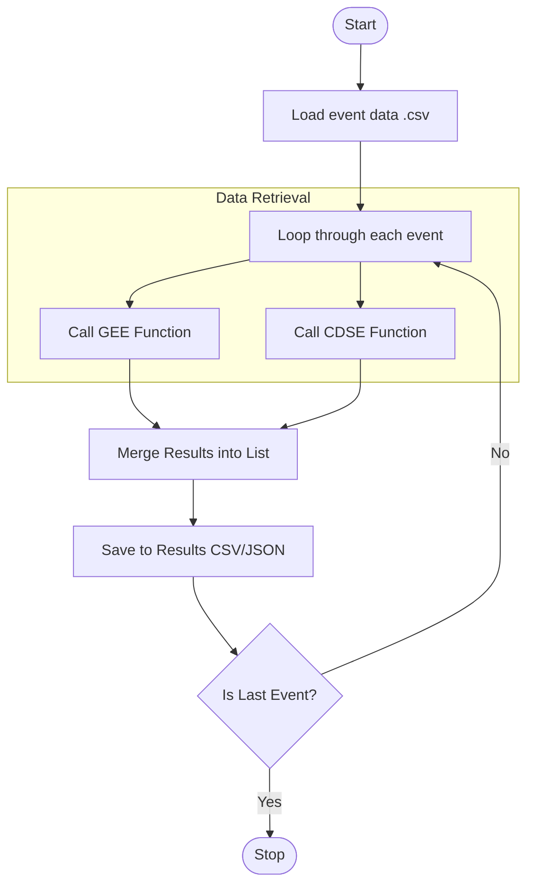

# **Project:** HAZAMA - A Flood Event Intelligent Information Acquisition System

# 1. Objective

Develop an automatic pipeline to cross-reference flood event lists with satellite imagery catalogs (Copernicus/ESA and Google Earth Engine), The system must identify and log available imagery that capture the flood location within a specific temporal and spatial windows.

# 2. Functional Requirements

## 2.1 Data Ingestion

The system must parse the input .csv with mandatory fields

- `event_id` : ID (String)
- `start_date` : Disaster occurrence date (ISO 8601: YYYY-MM-DD)
- `end_date` : Disaster end date (ISO 8601: YYYY-MM-DD)
- `bbox` : If specific area is not designated, set a default bbox (Float, WGS84)

## 2.2 Spatiotemporal Search

Use STAC API `pystac-client`

### 2.2.1 Collections:

- Sentinel-1
- Sentinel-2

### 2.2.2 Temporal Windows:

- pre-event: search for images within `[Date -15 days, Date -1 days]`
- post-event: search for images within `[Date, Date +3 days]`

### 2.2.3 Quality Check:

- coverage: coverage percentage in defined `bbox`
- metadata: meta data of every imagery must be queried

# 3. Techinical Architecture 

## 3.1 Platform Adapters

The system can select which sources will be used

- `fetch_GEE` : Interfaces with Google Earth Engine Python API
- `fetch_CDSE` : Interfaces with Copernicus Data Space Ecosystem

## 3.2 Error Handling

- missing data: If no image in bbox, the system must log a `NO_DATA_FOUND` warning

# 4. Output Specification

## 4.1 Output 

The output must be a .csv containing:

- `event_id`
- `metadata`
- `pre-event days`
- `post-event days`
- `cloud_coverage`
- `path` : local path of imagery in Cloud Optimized GeoTIFF (COG)
- `status` : `SUCCESS`, `NO_IMAGE`, `API_ERROR`

# 5. Definition of Done

1. Code passes ruff linting and formatting
2. Integration test: Successfully fetches 1 pre-event and 1 post-event image for a known sample case
3. Documentation: README.md updated with instructions on setting up GEE/CDSE credentials.

# 6. Flowchart



# 7. Environment Setup

1. Install: `uv sync --all-extras`
2. Run check: `uv run ruff check .`
3. Run tests: `uv run pytest`

# 8. Develop Workflow

1. create new branch for individual feature (e.g. feature/ingestion)
	```
	git checkout -b feature/ingestion
	uv sync
	```
2. wite tests
	```
	import pytest
	from src.ingestion import parse_event_csv

	def test_parse_valid_csv(tmp_path):
    # create a test CSV file
    d = data/test/"test.csv"
    d.write_text("event_id,start_date,end_date,bbox\nE001,2023-01-01,2023-01-05,'[120, 23, 121, 24]'")
    
    events = parse_event_csv(str(d))
    assert len(events) == 1
    assert events[0]['event_id'] == "E001"
	```
3. develop
	self check
	```
	uv run ruff format . 
	uv run ruff check --fix .
	```
4. uv run pytest
5. Pull Request(PR)
```
git add .
git commit -m "..."
git push origin feature/setup-guide
```